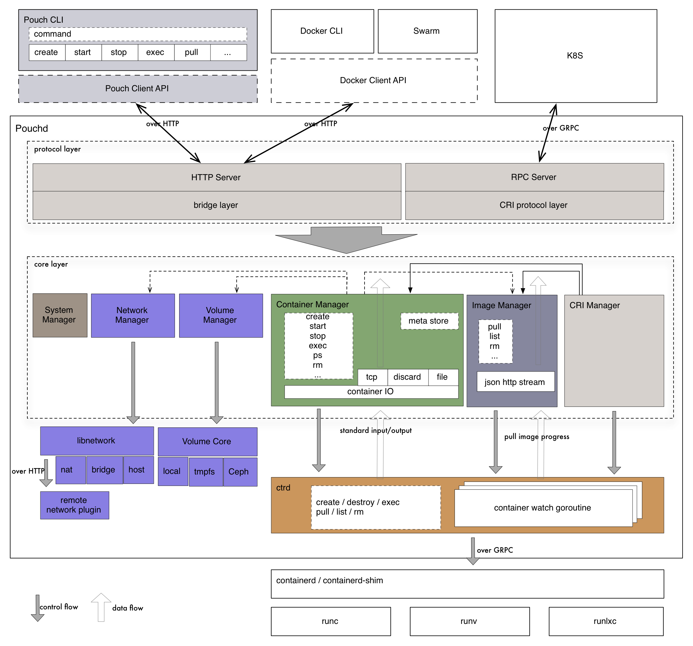

# Architecture

To clarify standpoint of Pouch in container system, we construct it with explicit architecture. To ensure the clear separation of functionality, we have organized Pouch with components. Therefore, when mentioning architecture, we usually include two parts:

* ecosystem architecture
* component architecture

## Ecosystem Architecture

In pouch's roadmap, we set ecosystem embracing as a big target. To upper orchestrating layer, pouch supports Kubernetes and Swarm. To underlying runtime layer, pouch is compatible with oci-compatible runtime, such as [runC](https://github.com/opencontainers/runc), [runV](https://github.com/hyperhq/runv), runlxc and so on. To make storage and network big supplements, [CNI](https://github.com/containernetworking/cni) and [CSI](https://github.com/container-storage-interface) are in scope right there.

The ecosystem architecture may be a little bit complicated at first glance. Take it easy. We can get a thorough understanding of it from the following three dimensions.

### Runtime Layer

Runtime layer is located on right-top in the architecture picture. This dimension mainly focus on OCI-compatible runtimes supported in Pouch. These runtimes unify specifications for standards on operating system process and application containers. Currently, Pouch supports four kinds of OCI-compatible runtimes:

* runC
* runlxc
* runV
* clear containers

With runC, Pouch creates common containers like other container engine does, for example docker. With runlxc, Pouch creates containers based on LXC. runlxc helps a lot when users need to run containers on a wide variaty of Linux kernels with the ability to be compatible with kernel 2.6.32+. Hypervisor-based containers have many application scenarios as well. Pouch will support it with runV and clear container. 

All these four runtimes mentioned above are supported under containerd. Containerd takes over all detailed container management, including creation, start, stop, deletion and so on.

### Orchestration Layer

Pouch is always active on supporting Kubernetes since the first day when it is designed. We illustrate this part on the top half of the archtecture picture. First, Pouch will integrate cri-containerd inside, so Kubernetes can easily dominate Pouch to manage Pod. The workflow will pass cri-containerd, containerd client, containerd, runC/runV and pod. When configuring network of Pod, cri-containerd will take advantanges of network plugins which implement CNI interface.

### Container Layer

We support not only Pod in Kubernetes cluster, but also simple container management for users. This is especially useful for developers. In anonther word, Pouch supports single container API. In this way, workflow passes pouchd, containerd client, containerd, runC/runV and container. On the aspect of network, Pouch uses libnetwork to construct container's network. What's more, lxcfs is also used to guarantee the isolation between containers and between containers and host.

## Component Architecture

Ecosystem architecture of Pouch shows the location of itself in the container ecosystem. The following picture shows the component architecture of Pouch. In component architecture, we divide Pouch into two main parts: Pouch CLI and Pouchd.

### Pouch CLI

There are lots of different commands encapsulated in Pouch CLI, like create, start, stop, exec and so on. Users can interact with Pouchd by Pouch CLI. When executing a command, Pouch CLI will translate it into Pouchd API calls to satisfy users' demand. Pouch Client API is a well-encapsulated package in Pouch CLI. It is very easy for others to integrate Pouch Client Package into third-party software. And this package currently only supports Golang language. When calling Pouchd via Pouch Client Package, the communication is over HTTP.

### Pouchd

Pouchd is designed decoupled from the very beginning. It makes Pouchd quite easy to understand. And it helps a lot for us to hack on Pouch. In general, we treat that Pouchd can be split into the following pieces:

* HTTP server
* bridge layer
* Manager(System/Network/Volume/Container/Image)
* ctrd

**HTTP Server** receives API calls directly and replies to client side. Its job is to parse requests and construct correct struct which is supposed to be passed to bridge layber, and to construct response no matter server succeeds in handling request or fails.

**bridge layer** is a translation layer which handles objects from client to meet managers or containerd's demand and handles objects from managers and containerd to make response compatible with Moby's API.

**Manager** is main processor of Pouchd. It deals proper object from requests, and does the corresponding work. There are five managers currently in Pouchd: container manager, image manager, newtork manager, volume manager and system manager.

**ctrd** is containerd client in Pouchd. When managers need to communicate with container, ctrd is the right thing to do this work. Managers call functions in ctrd and send request torwards containerd. In addition, when state of container changes, containerd is the first component to be awared of this, and ctrd has container watch goroutines to detect this and update inner data stored in cache.
