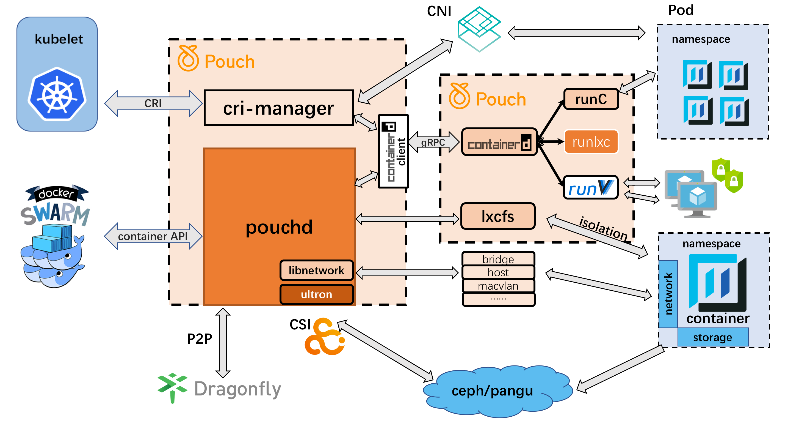

# Architecture

To clarify standpoint of Pouch in container system, we construct it with explicit architecture. To ensure the clear separation of functionality, we have organized Pouch with components. Therefore, when mentioning architecture, we usually include two parts:

* ecosystem architecture
* component architecture

## Ecosystem Architecture

In pouch's roadmap, we set ecosystem embracing as a big target. To upper orchestrating layer, pouch supports Kubernetes and Swarm. To underlying runtime layer, pouch is compatible with oci-compatible runtime, such as [runC](https://github.com/opencontainers/runc), [runV](https://github.com/hyperhq/runv), runlxc and so on. To make storage and network big supplements, [CNI](https://github.com/containernetworking/cni) and [CSI](https://github.com/container-storage-interface) are in scope right there.

## Component Architecture

To be added soon.