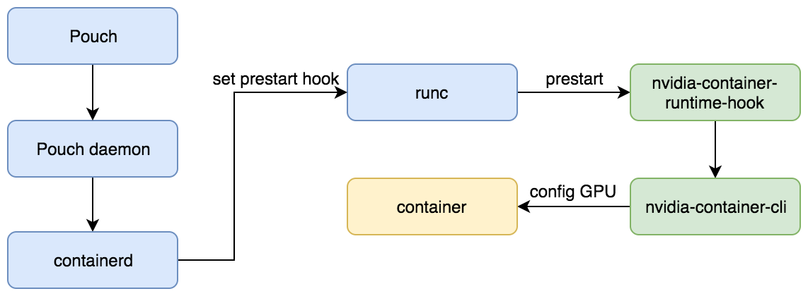

# PouchContainer with GPU

NVIDIA uses containers to develop, test, benchmark, and deploy deep learning (DL) frameworks and HPC applications. A variety of customers used NVIDIA-Container-Runtime to containerize and run GPU accelerated workloads. The NVIDIA-Container-Runtime is the next-generation GPU-aware container runtime. It is compatible with the Open Containers Initiative (OCI) specification used by Pouch and other popular container technologies.

## nvidia gpu runtime



The figure shows how the NVIDIA-Container-Runtime integrates into Pouch. We set a custom OCI prestart hook called nvidia-container-runtime-hook to runc in order to enable GPU containers.

## Prerequisites Installation

Make sure you have installed the NVIDIA driver

1. GNU/Linux x86_64 with kernel version > 3.10
2. NVIDIA GPU with Architecture > Fermi (2.1)
3. NVIDIA drivers ~= 361.93 (untested on older versions)

## Start GPU container

Pouch support 2 method to start GPU container

1. Via nvidia config API, [nvidiaconfig](https://github.com/alibaba/pouch/blob/master/docs/api/HTTP_API.md#nvidiaconfig)
2. Via Environment variables, [nvidia-container-runtime-env](https://github.com/NVIDIA/nvidia-container-runtime#environment-variables-oci-spec)

### Via API

```shell
pouch run -it --nvidia-capabilities=all --nvidia-visible-devs=all centos:7 bash
```

### Via Environment variables

The NVIDIA Container Runtime uses environment variables in container images to specify a GPU accelerated container.

```shell
pouch run -it -e NVIDIA_VISIBLE_DEVICES=all -e NVIDIA_DRIVER_CAPABILITIES=all centos:7 bash
```