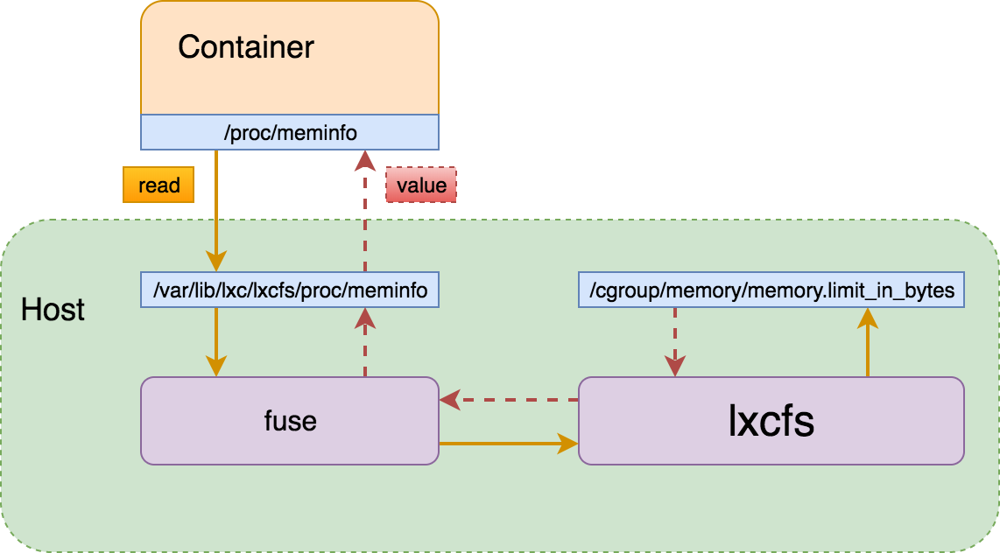

# Pouch with LXCFS

Container technology provides different isolation environment from traditional virtualization technologies, such as VMware, KVM. The general Linux containers accelerate container packaging and setup speed at the cost of weakening isolation. Resource view of container is one the most well-known isolation issues general Linux containers suffer.

Container solutions provide a general way for users to limit resource usage of running containers, such as memory, cpu, blkio and so on. Processes in container have no ability to access extra corresponding resources beyond the limited values indeed. However, if processes inside inspect the resource upper limit by command `free`, `cat /proc/meminfo`, `cat /proc/cpuinfo`, `cat /proc/uptime`, they will definitely get information which is correct for host machine, not for container itself.

For example, if we create a general container with limiting 200 MB memory on host of 2 GB memory in total, we can find that resource upper limit is incorrect via command `free`, and it shows all memory size of the host:

``` shell
$ pouch run -m 200m registry.hub.docker.com/library/ubuntu:16.04 free -h
              total        used        free      shared  buff/cache   available
Mem:           2.0G        103M        1.2G        3.3M        684M        1.7G
Swap:          2.0G          0B        2.0G
```

## Resource View Isolation Scenario

Lacking of resource view isolation, applications may be running abnormally in environment provided by container. Application may be ware of that its runtime is not like that in usual physical machine or virtual machine. Here are some examples that isolation vulnerability influence application's running:

> For plenty of Java applications which are based on JVM, application startup script would mostly rely on the system resource capacity to allocate heap and stack size for JVM. As a result, application in a 200 MB memory limited container, which is created on a host of 2 GB memory capacity, will think it has rights to access the whole 2 GB memory, then startup script tells Java runtime to allocate heap and stack size according to 2GB which is totally different from it actual maximum size 200 MB. Application startup would fail definitely. Also for Java applications, some libraries would allocated heap and stack size according to their resource view, this will expose potential security issues as well.

Not only memory resource view's concern, but also weak CPU resource view isolation.

> Most midware software would setup default thread number according to cpuinfo from its view. It is quite reasonable for users to configure a container's cpuset which will take effect in cgroup files. However, processes in container always get the whole cores number by accessing `/proc/cpuinfo` which definitely causes unstable issues.

Resource view isolation will influence system-level applications in container.

> Containers can also be used to package system-level applications, and system-level applications would usually need to get system information via Virtual File System `/proc`. If uptime is not the correct one of container but the host, system-level applications would be out of control or running in an unexpected way. `cpuinfo` and `meminfo` and some further system resource views are other aspects these applications need to consider.

## What is LXCFS

[LXCFS](https://github.com/lxc/lxcfs) is a small [FUSE filesystem](https://en.wikipedia.org/wiki/Filesystem_in_Userspace) written with the intention of making Linux containers feel more like a virtual machine. It started as a side-project of LXC but is usable by any runtime. LXCFS is compatible on Linux kernel 2.6+. And LXCFS will take care that the information provided by crucial files in `procfs` such as:

* /proc/cpuinfo
* /proc/diskstats
* /proc/meminfo
* /proc/stat
* /proc/swaps
* /proc/uptime

Pouch has supported LXCFS in early versions and has been stable. In another word, if users enable LXCFS, there will be a daemon process lxcfs running on host. Generally, when creating a container with resource limit, some virtual files mapping this container would be created in cgroup filesystem. And LXCFS would dynamically read value in these files like `memory.limit_in_bytes`, and generate a branch new virtual file on the host(for example `/var/lib/lxc/lxcfs/proc/meminfo`), then binding this file to the container. At last, processes in container would get the real resource view by reading files like `/proc/meminfo`.

Here is the architecture of LXCFS and container:



## Get Started

It is quite transparent and easy for users to enjoy resource view isolation by enabling LXCFS. Actually, software LXCFS would be automatically installed on host along with pouch software if it does not exist in $PATH.

Before experiencing LXCFS guaranteed resource view isolation, user needs to make sure that LXCFS mode is enabled in pouchd. If LXCFS mode has not been set, user needs to stop pouchd and start pouchd via command `pouchd --enable-lxcfs`. Only by enabling LXCFS mode in pouchd can users make use of LXCFS functionality in containers.

With LXCFS mode enabled in pouchd, pouchd has extra ability to create containers which has isolated resource view. Besides this, pouchd is still capable to create general ones without resource view isolation.

At last, `--enableLxcfs` flag in command `pouch run` is the only way to make LXCFS work for created containers under pouch daemon which is already enabled LXCFS mode. Here we create a container with 200 MB memory limit on the host of 2 GB memory.

``` shell
$ pouch run -m 200m --enableLxcfs registry.hub.docker.com/library/ubuntu:16.04 free -h
              total        used        free      shared  buff/cache   available
Mem:           200M        876K        199M        3.3M         12K        199M
Swap:          2.0G          0B        2.0G
```

We can see that total memory size displayed is exactly the same as memory upper limit of container.

After executing command above, we will find that resource view of processes in container is its real resource upper limit. In another word, applications in container turns much more secure than usual. This is designed to be one kind of essential ability of Pouch.
