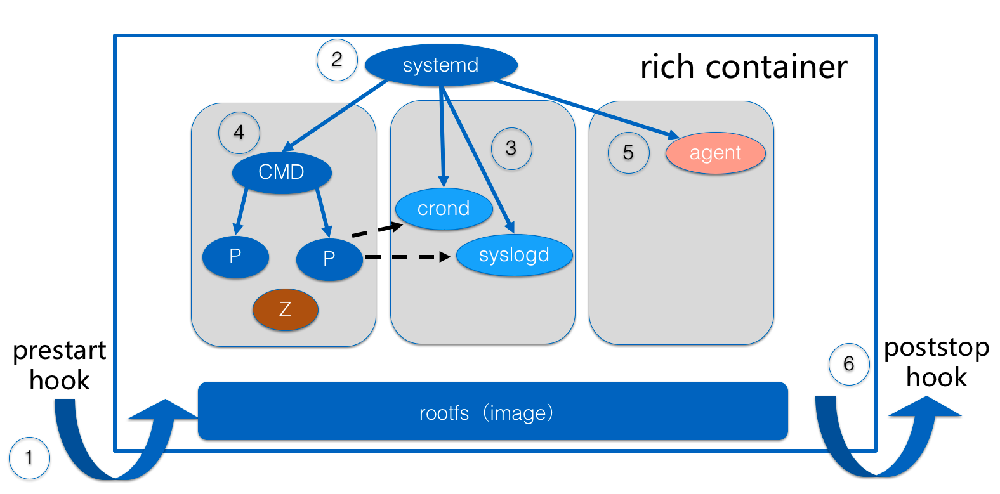

# Rich Container

Rich container is a very useful container mode when containerizing applications. This mode helps technical staff to complete packaging fat applications almost with no effort. It provides efficient ways to equip more basic software or system services except for target application in a single container. Then applications in containers could be running as smoothly as usual in VM or physical machine. This is a more generalized application-centric mode. This mode brings no invasiveness at all to both developers and operators. Especially for operators, they could have abilities to maintain applications in container with all essential tools or service processes they may need as usual.

Rich container mode is not the default mode PouchContainer provides. It is an additional mode PouchContainer brings to extend users' container experience. Users can still manage ordinary containers by switching rich container flag off.

In a word, rich container can help enterprise to achieve the following two goals:

* be compatible with legacy operating system;
* still take advantanges of image concept to speed up application delivery.

## Scenario

Container technology and orchestration platforms have turned quite popular right now. They both offer much better environment for applications. Despite this, we have to say containerization is the first step for enterprises to embrace container-related technologies, such as container, orchestration, service mesh and so on. It is quite a real problem to move traditional application into containers. Although some simple applications are always showing friendly to container, more traditional and complicated enterprise applications may not so lucky. These traditional applications are usually coupled with underlying infrastructure, such as architecture of machine, old kernels, even certain software out of maintenance as well. Definitely, strong coupling is not everyone's dish. It is the initiator on the road of digital transformation in enterprises. So, all the industry is seeking one possible way to work it out. The way docker provides is one, but not the best. In the past 7 years, Alibaba has also experienced the same issue. Fortunately, rich container mode is a much better way to handle this.

Developers have their own programming style. Their work is to create useful applications, not to design absolute decoupled ones, so they usually take advantages of tools or system services to make it. When containerizing these applications, it is quite weak if only setting one application one process in container. Rich container mode finds out ways to make users configure the inner startup sequence of processes in container including application and system services around.

Operators have a sacred duty to guard normal running of the applications. For the sake of business running in applications, technology must show enough respect for operator's tradition. Environment change is not a good message when debugging and solving issue online. Rich container mode can ensure that environment in rich container in totally the same as that in traditional VM or physical machine. If operator needs some system tools, they are located there still. If some pre and post hooks should take effect, just set them when starting rich containers. If some issues happen inside, system services started by rich container can fix them just like self-healing.

## Architecture

Rich container mode is compatible with the legacy operation ways for operation team. The following architecture graph shows how to achieve this:



To be more detailed, rich container promises to be compatible with oci-compatible image. When running a rich container, pouchd would take image filesystem as the rootfs of rich container itself. In the runtime of inner container, besides inner applications and system servcies, there are also some hooks like prestart hook and poststop hook. The previous one focuses on how to prepare or intialize the environment before systemd and related process run. And the latter one is almost on cleanup work when container stops.

## Get started

Users can start rich container mode in PouchContainer quite easily. Provided that we need to running an ordinary image in rich container mode via PouchContainer, there are only two flags we may add: `--rich`,`--rich-mode`and `--initscript`. Here are more description about both flags:

* `--rich`: identifies whether to switch on rich container mode or not. This flag has a type of `boolean`, and the default value is `false`.
* `--rich-mode`: select which manner to init container, currently systemd, /sbin/init and dumb-init are supported. By default, it is dumb-init.
* `--initscript`: identifies initial script executed in container. The script will be executed before entrypoint or command. Sometimes, it is called prestart hook. Lots of work can be done in this prestart hook, such as environment checking, environment preparation, network routes preparation, all kinds of agent settings, security setting and so on. This initscript may fail and user gets an related error message, if pouchd cannot find this initscript in container's filesystem which is provided by the rootfs constructed from image and potential mount volumes actually outside the container. If initscript works fine, the control of container process would be taken over by process pid 1, mainly `/sbin/init` or `dumbinit`.

In fact, PouchContainer team plans to add another flag `--initcmd` to make users input prestart hook. Actually it is a simplified one of `--initscript`. Meanwhile it brings more convenience than `--initscript`. `--initcmd` can set any command as user's wish, and things do not need to be located in image in advance. We can say command is decoupled with image. But for `--initscript`, script file must be located in image first. It is some kind of coupling.

If user specifies `--rich` flag and no `--initscript` flag is provided, rich container mode will still be enabled, but no initscript will be executed. If `-rich` flag misses in command line, while `--initscript` is there, PouchContainer CLI or pouchd will return an error to show that `--initscipt` can only be used along with `--rich` flag.

If a container is running with `--rich` flag, then every start or restart of this container will trigger the corresponding initscipt if there is any.

### Using dumb-init

Here is a simple example for rich container mode using dumb-init to init container:

1. Install dumb-init as following:

```shell
# wget -O /usr/bin/dumb-init https://github.com/Yelp/dumb-init/releases/download/v1.2.1/dumb-init_1.2.1_amd64
# chmod +x /usr/bin/dumb-init
```

2. Run a container with rich mode:

```shell
#pouch run -d --rich --rich-mode dumb-init registry.hub.docker.com/library/busybox:latest sleep 10000
f76ac1e49e9407caf5ad33c8988b44ff3690c12aa98f7faf690545b16f2a5cbd

#pouch exec f76ac1e49e9407caf5ad33c8988b44ff3690c12aa98f7faf690545b16f2a5cbd ps -ef
PID   USER     TIME  COMMAND
1 root      0:00 /usr/bin/dumb-init -- sleep 10000
7 root      0:00 sleep 10000
8 root      0:00 ps -ef
```

### Using systemd or sbin-init

In order to use systemd or /sbin/init to init container, please make sure to install them in image. Please use pouch version not lower than 1.1.0 if you want to use systemd rich mode.
As shown below, centos image has both of them.
Also `--privileged` is required in this situation. An example of systemd and sbin-init is as following:

```
# cat /tmp/1.sh
! /bin/sh
echo $(cat) >/tmp/xxx

#pouch run -d -v /tmp:/tmp --privileged --rich --rich-mode systemd --initscript /tmp/1.sh registry.hub.docker.com/library/centos:latest /usr/bin/sleep 10000
3054125e44443fd5ee9190ee49bbca0a842724f5305cb05df49f84fd7c901d63

# pouch exec 3054125e44443fd5ee9190ee49bbca0a842724f5305cb05df49f84fd7c901d63 ps aux
USER        PID %CPU %MEM    VSZ   RSS TTY      STAT START   TIME COMMAND
root          1  7.4  0.0  42968  3264 ?        Ss   05:29   0:00 /usr/lib/systemd/systemd
root         17  0.0  0.0  10752   756 ?        Ss   05:29   0:00 /usr/lib/systemd/systemd-readahead collect
root         18  3.2  0.0  32740  2908 ?        Ss   05:29   0:00 /usr/lib/systemd/systemd-journald
root         34  0.0  0.0  22084  1456 ?        Ss   05:29   0:00 /usr/lib/systemd/systemd-logind
root         36  0.0  0.0   7724   608 ?        Ss   05:29   0:00 /usr/bin/sleep 10000
dbus         37  0.0  0.0  24288  1604 ?        Ss   05:29   0:00 /bin/dbus-daemon --system --address=systemd: --nofork --nopidfile --systemd-activation
root         45  0.0  0.0  47452  1676 ?        Rs   05:29   0:00 ps aux

# cat /tmp/xxx
{"ociVersion":"1.0.0","id":"3054125e44443fd5ee9190ee49bbca0a842724f5305cb05df49f84fd7c901d63","status":"","pid":125745,"bundle":"/var/lib/pouch/containerd/state/io.containerd.runtime.v1.linux/default/3054125e44443fd5ee9190ee49bbca0a842724f5305cb05df49f84fd7c901d63"}

# pouch run -d -v /tmp:/tmp --privileged --rich --rich-mode sbin-init --initscript /tmp/1.sh registry.hub.docker.com/library/centos:latest /usr/bin/sleep 10000
c5b5eef81749ce00fb68a59ee623777bfecc8e07c617c0601cc56e4ae8b1e69f

# pouch exec c5b5eef81749ce00fb68a59ee623777bfecc8e07c617c0601cc56e4ae8b1e69f ps aux
USER        PID %CPU %MEM    VSZ   RSS TTY      STAT START   TIME COMMAND
root          1  7.4  0.0  42968  3260 ?        Ss   05:30   0:00 /sbin/init
root         17  0.0  0.0  10752   752 ?        Ss   05:30   0:00 /usr/lib/systemd/systemd-readahead collect
root         20  3.2  0.0  32740  2952 ?        Ss   05:30   0:00 /usr/lib/systemd/systemd-journald
root         34  0.0  0.0  22084  1452 ?        Ss   05:30   0:00 /usr/lib/systemd/systemd-logind
root         35  0.0  0.0   7724   612 ?        Ss   05:30   0:00 /usr/bin/sleep 10000
dbus         36  0.0  0.0  24288  1608 ?        Ss   05:30   0:00 /bin/dbus-daemon --system --address=systemd: --nofork --nopidfile --systemd-activation
root         45  0.0  0.0  47452  1676 ?        Rs   05:30   0:00 ps aux

# cat /tmp/xxx
{"ociVersion":"1.0.0","id":"c5b5eef81749ce00fb68a59ee623777bfecc8e07c617c0601cc56e4ae8b1e69f","status":"","pid":127183,"bundle":"/var/lib/pouch/containerd/state/io.containerd.runtime.v1.linux/default/c5b5eef81749ce00fb68a59ee623777bfecc8e07c617c0601cc56e4ae8b1e69f"}
```

## Underlying Implementation

Before learning underlying implementation we shall take a brief review of `systemd`, `entrypoint` and `cmd`. In addition, prestart hook is executed by runC.

### systemd, entrypoint and cmd

To be added

### initscript and runC

`initscript` is to be added.

`runc` is a CLI tool for spawning and running containers according to the OCI specification.
