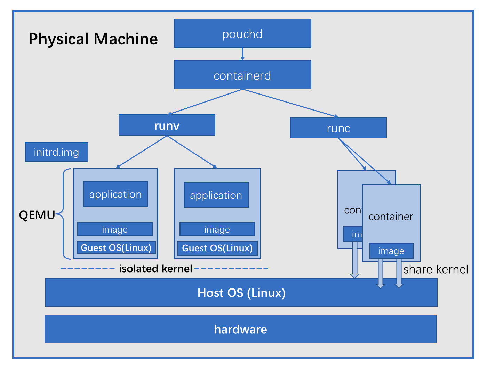

# PouchContainer with runV

Container technology develops rapidly recently. It provides much convenience for application packing and resource utilization improvement. At the same time it brings benefits, LXC-based container technology also loses the appropriate security. Specifically, containers share operating system kernel on one machine. Once one container attempts to attack kernel, all workload on this host would be influenced.

For some scenarios which are sensitive and strict to security, pure container technology has apparent defects. What's more, in cloud era multi-tenancy is the rigid demand from cloud customers. Therefore, strong isolation must be guaranteed seriously. In another word, container technology needs more security hardening.

[runV](https://github.com/hyperhq/runv) is a hypervisor-based runtime for [OCI](https://github.com/opencontainers/runtime-spec). It can easily help improve host and container's security by virtualizing a guest kernel which isolates containers and host with a clearer boundary. Although hypervisor-base container brings more commitment on security, it loses some performance caused by virtualization technology. And it takes a little more time to start a container, since more work needs done, like initrd.img loading, kernel loading, system process bootup and so on.

## Architecture

Supporting hypervisor-based OCI runtime is one of PouchContainer's goals. PouchContainer allows users to decide which kind of container to create. So with a unified entry of PouchContainer's API, users can create both hypervisor-based containers and LXC-based containers. With two kinds of carriers above, user's application can flexibly choose runtime on demand.

Here is the architecture of PouchContainer's supporting both runV and runC:



## Prerequisites Installation

Before installing, We should remind one important thing: **PouchContainer with runv can only work on PHYSICAL MACHINE**. Nested VMs currently are not supported yet. In addition, we should make sure that `containerd` and `pouchd` are already installed on the physical machine which is described in [INSTALLATION.md](../../INSTALLATION.md).

Make sure things above have been done. And then there are another three prerequisites to install before experiencing hypervisor-based containers:

* [QEMU](https://www.qemu.org): a generic machine emulator and virtualizer.
* [runv](https://github.com/hyperhq/runv): OCI-compatible runtime binary.
* [hyperstart](https://github.com/hyperhq/hyperstart): a tiny init service for hypervisor-based container.

### Install QEMU

[QEMU](https://www.qemu.org) is required to run VMs. We can execute following commands to easily install QEMU related tools.

On physical machine with Ubuntu OS installed:

```
sudo apt-get install -y qemu qemu-kvm
```

On physical machine with RedHat series OS installed:

```
sudo yum install -y qemu qemu-kvm
```

### Install runV

[runv](https://github.com/hyperhq/runv) does not provide binary package. We need to build it from source code.

First, clone version v1.0.0 of runv project from GitHub:

```
mkdir -p $HOME/go/src/github.com/hyperhq
cd $HOME/go/src/github.com/hyperhq
git clone --branch v1.0.0 https://github.com/hyperhq/runv.git
```

Second, build runv from source code:

```
sudo apt-get install autotools-dev
sudo apt-get install automake
cd runv
./autogen.sh
./configure
make
sudo make install
```

Then binary runv will be located in your PATH.

### Install hyperstart

[hyperstart](https://github.com/hyperhq/hyperstart) provides init task for hypervisor-based containers. We need to build guest kernel and initrd.img from source code version v1.0.0 as well:

```
cd $HOME/go/src/github.com/hyperhq
git clone --branch v1.0.0 https://github.com/hyperhq/hyperstart.git
cd hyperstart
./autogen.sh
./configure
sudo make
```

After building kernel and initrd.img successfully, we should copy guest `kernel` and `initrd.img` to the default directory which runv will look for.

```
mkdir /var/lib/hyper/
cp build/{kernel,hyper-initrd.img} /var/lib/hyper/
```

## Start Hypervisor-based Container

With runv related tools installed, we need to start pouchd. Then we can create hypervisor-based container via command line tool `pouch`. The container created has an independent kernel isolated from host machine.

We can create hypervisor-based container by adding a flag `--runtime` in create command. And we can also use `pouch ps` to list containers including hypervisor-based containers whose runtime type is `runv` and runc-based containerd whose runtime type is `runc`.

First, add runv into config file, restart pouchd, ensure that pouchd know the specified runtime.

```
{
    "add-runtime": {
        "runv": {
            "path": "/usr/local/bin/runv"
        }
    }
}
```

``` shell
$ pouch create --name hypervisor --runtime runv docker.io/library/busybox:latest
container ID: 95c8d52154515e58ab267f3c33ef74ff84c901ad77ab18ee6428a1ffac12400d, name: hypervisor
$
$ pouch ps
Name         ID       Status    Image                              Runtime
hypervisor   95c8d5   created   docker.io/library/busybox:latest   runv
4945c0       4945c0   stopped   docker.io/library/busybox:latest   runc
1dad17       1dad17   stopped   docker.io/library/busybox:latest   runv
fab7ef       fab7ef   created   docker.io/library/busybox:latest   runv
505571       505571   stopped   docker.io/library/busybox:latest   runc
```

What's more, we are able to check different kernels of host physical machine and hypervisor-based container, like below:

``` shell
# one host physical machine
$ uname -a
Linux www 4.4.0-101-generic #124-Ubuntu SMP Fri Nov 10 18:29:59 UTC 2017 x86_64 x86_64 x86_64 GNU/Linux
$
# gen tunnel into hypervisor-based container
# check inside kernel
$ pouch start hypervisor -i
/ # uname -a
Linux 4.12.4-hyper #18 SMP Mon Sep 4 15:10:13 CST 2017 x86_64 GNU/Linux
```

It turns out that in experiment above kernel in host physical machine is 4.4.0-101-generic, and that in hypervisor-based container is 4.12.4-hyper. Obviously, they are isolated from each other in term of kernel.

## Run legacy kernels

runV(now kata containers) provides a general way to provide an isolated Linux kernel still based on OCI-compatible images. To be honest, Linux kernel running in Guest OS provisioned by runV is quite advanced and new. However, how to make legacy Linux kernel run in Guest OS is still a really huge challenge for the industry when using runV.

### Scenario

It is quite reasonable to make runV provide Guest OS which is running legacy Linux kernel, such as Linux kernel 2.6.32. For the entire industry, there are so much workload running on legacy Linux kernels. If all these workload could only be running on legacy kernels(usually operation team in enterprise could not bear the risk to upgrade legacy Linux kernel to new ones like 4.12 or 4.14), applications in this environment cannot take adavantage of cutting edge technology like container and Kubernetes and so on. Actually no application delivery speed would be gained without doubt, which is fatal in the era of The Internet.

### Legacy kernel support

However, PouchContainer figuires out one way to containerize application which must be running on legacy kernel. This solution is still working on runV. While this part needs to do lots of work to backport new kernel features to the legacy kernel(this part is somewhat difficult to be open source). The following demo shows how to make a Linux kernel 2.6.32 run in Guest OS provided by runV: [make legacy kernel in Guest OS](https://www.youtube.com/watch?v=1w5Ams2k-40).

## Conclusion

PouchContainer brings a common way to provide hypervisor-based containers. With PouchContainer, users can take advantages of both hypervisor-based containers and LXC-based containers according to specific scenario.


