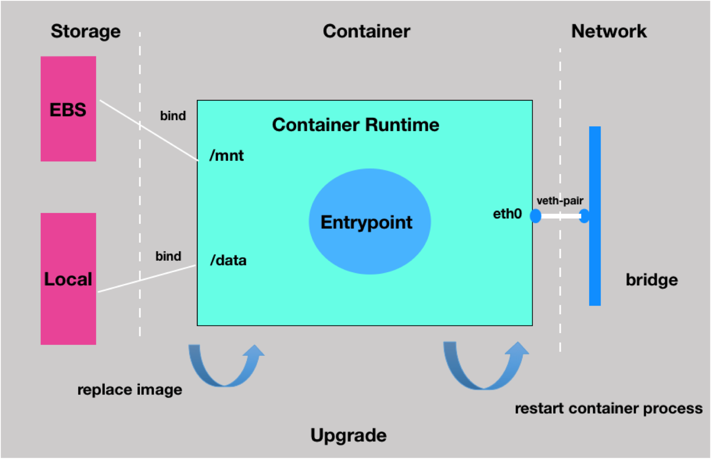

# Upgrade Container

## Introduction

In the cloud native world, developers were encouraged to build stateless apps, because stateful apps didn't scale well in the cloud's distributed. But there are still many  stateful apps, like database, desktop and operating systems appplication. Even in kubernetes, there is a [StatefulSet](https://kubernetes.io/docs/tutorials/stateful-application/basic-stateful-set/) component to manage the stateful applications.

The stateful service upgrade requires that the new container must inherit all resources of old container, such as network and storage. The following two cases are the service provision scenarios of stateful containers:

* Customer Case 1: In a database service, remote data is downloaded to the local computer as the initial data in the database when the container service is created for the first time. Database initialization lasts for a long time, so the new container must inherit the data stored on the old container in the consequent service upgrades to shorten the service provision time.

* Customer Case 2: In a middleware service, the service registration mode is used. That is, the IP addresses of the scaled-up containers must be registered in the server list; otherwise, the containers are invalid. The new containers must inherit the IP addresses of old containers every time the service containers are upgraded; otherwise, the new services are invalid.

How to make the upgrade procedure of stateful containers more simplified and more efficient that is what `upgrade` API of pouchd aims to achieve.

## Design

The following architecture graph shows how to upgrade a container:

* First, inherit container attributes from the old container in pouchd's memory;
* Second, use new image to prepare container rootfs and replace the container's CMD via the [Which CMD is used when upgrading a container](#which-CMD-is-used-when-upgrading-a-container) describe below;
* Third, just start the newly constructed command if needed.



### Difference between Update and Upgrade API

Since pouch already has a `update` interface, so we must to distinguish `upgrade` from `update`. If you want to update a container's [Resources](../../apis/types/resources.go), I think you should use the `update` interface, But if you just want to update a container's image and inherit the volumes and network from the old container, now you should use the `upgrade` interface.

### About API

Now, `upgrade` api request body is below, we only support you to specify the Image which used to create a new container and the new `Entrypoint` and `Cmd` that the new container used to run.

```golang
type ContainerUpgradeConfig struct {

	// Execution commands and args
	// Min Items: 1
	Cmd []string `json:"Cmd"`

	// The entrypoint for the container as a string or an array of strings.
	// If the array consists of exactly one empty string (`[""]`) then the entry point is reset to system default.
	//
	Entrypoint []string `json:"Entrypoint"`

	// image
	// Required: true
	Image string `json:"Image"`
}
```

**Notes**: `It is enough to upgrade a container with those parameters. If anyone has new situation need to add more parameters into ContainerUpgradeConfig, we can create a new issue to discuss it.`

### About core logic

#### Which CMD is used when upgrading a container

There are four commands as mentioned below, when create a new container in upgrade, the order of using the command is:

* CMD3 should be used if specified;
* CMD1 should be used if CMD3 is not specified;
* CMD4 should be used if CMD1 is also not specified;
* CMD2 may never be used.

|cmd|named|
|---|---|
|Old cmd of `ContainerConfig`| CMD1|
|Old cmd of old image| CMD2|
|New cmd of `ContainerUpgradeConfig`|CMD3|
|New cmd of new image|CMD4|

#### Inherit the volumes and network from the old container when create a new container

* Network: before create a new container, we should first stop the old container if is running, then we can use the network config of the old container.

* Storage: new container inherits all the mounts information of the old one, so we can use the volumes used by old container, and we should also parse the volume information contained in new image.

#### Prepare rootfs for the new container

In [containerd](https://github.com/containerd/containerd), using a new snapshot to represent the rootfs of container when create a new container. So we should use the new image to create a new snapshot for the new container in `upgrade`. In case of snapshot name conflicted, we add a random suffix string to the container id as the name of the new snapshot.

#### Rollback of upgrade failure

When any errors occurred during the `upgrade` procedure, pouchd will automatically rollback the whole `upgrade` operation and the old container will be recovered just like it was.

### Quick Start

```shell

# create a new container with busybox image
$ pouch run -t -d registry.hub.docker.com/library/busybox:latest top
33c6c770fa45fc45db7ebe64732cb623e365c67b9e7f30ea7f830410bbac0608

$ pouch ps
Name     ID       Status         Created         Image                                            Runtime
33c6c7   33c6c7   Up 3 seconds   4 seconds ago   registry.hub.docker.com/library/busybox:latest   runc

# upgrade the container using centos image and change the CMD from top to sh
$ pouch upgrade  --image registry.hub.docker.com/library/centos:latest 33c6c7 sh
33c6c7

# container's image has changed to centos
$ pouch ps
Name     ID       Status         Created        Image                                           Runtime
33c6c7   33c6c7   Up 2 seconds   1 minute ago   registry.hub.docker.com/library/centos:latest   runc

# check the cmd of new container, the init process is sh
$ pouch exec -it 33c6c7 bash
[root@33c6c770fa45 /]# ps aux
USER       PID %CPU %MEM    VSZ   RSS TTY      STAT START   TIME COMMAND
root         1  0.1  0.0  11816  1440 pts/0    Ss+  07:22   0:00 sh
root         5  0.3  0.0  11816  1844 pts/1    Ss   07:22   0:00 bash
root        17  0.0  0.0  51708  1704 pts/1    R+   07:22   0:00 ps aux

```
