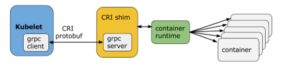

# Pouch with CRI introduction

## What is CRI

The Container Runtime Interface (CRI) is a plugin interface which enables kubelet to use a wide variety of container runtimes, without the need to recompile. 
CRI (_Container Runtime Interface_) consists of a [protobuf API](https://github.com/kubernetes/kubernetes/blob/master/pkg/kubelet/apis/cri/runtime/v1alpha2/api.proto),specifications/requirements and [libraries](https://git.k8s.io/kubernetes/pkg/kubelet/server/streaming)for container runtimes to integrate with kubelet on a node.

This diagram explains how the Container Runtime Interface works:

## Why need to implement CRI in pouch

The purpose of the pouch CRI implementation is to integrate with Kublete.This allows Kubernetes to directly launch and manage containers through the pouch CRI.

## Application scene

Manage containers via Kubernetes.

## Pouch CRI Create a single-container pod

Let's use an example to demonstrate how pouch-cri works for the case when Kubelet creates a single-container pod:

* Kubelet calls pouch-cri, via the CRI runtime service API, to create a pod.
* pouch uses containerd to create and start a special pause container (the sandbox container) and put that container inside the pod’s cgroups and namespace (steps omitted for brevity).
* pouch configures the pod’s network namespace using CNI.
* Kubelet subsequently calls pouch-cri, via the CRI image service API, to pull the application container image.
* Kubelet then calls pouch-cri, via the CRI runtime service API, to create and start the application container inside the pod using the pulled container image.
* pouch finally calls containerd to create the application container, put it inside the pod’s cgroups and namespace, then to start the pod’s new application container.

After these steps, a pod and its corresponding application container is created and running.

## Pouch CRI workflow

This diagram briefly explains pouch CRI internal module workflow：

