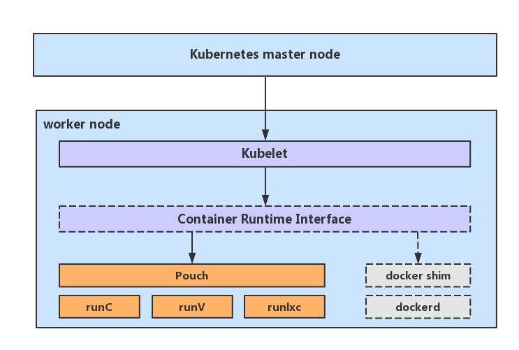

# Deploy Kubernetes With PouchContainer

- [Overview](#overview)
- [Prerequisite](#Prerequisite)
  - [Software Version Requirement](#software-version-requirement)
  - [Node Resource Requirement](#node-resource-requirement)
- [Install and Configure PouchContainer](#install-and-configure-PouchContainer)
  - [Install PouchContainer](#install-pouchcontainer)
  - [Configure PouchContainer](#configure-pouchContainer)
  - [Restart PouchContainer](#restart-pouchcontainer)
  - [Verify PouchContainer Correctness](#verify-pouchcontainer-correctness)
- [Install and Configure Kubernetes](#install-and-configure-kubernetes)
  - [Download Kubernetes Packages](#Download-Kubernetes-Packages)
  - [Configure Kubernetes Components](#Configure-Kubernetes-Components)
  - [Setup Kubernetes Cluster](#setup-kubernetes-cluster)
  - [Verify Kubernetes Correctness](#verify-Kubernetes-Correctness)
- [Setup CNI network](#Setup-CNI-network)
  - [flannel](#flannel)
  - [Calico](#Calico)

## Overview

This document shows how to easily install a Kubernetes cluster with PouchContainer as the container runtime. For Chinese customers, it might be faster and easier to download Kubernetes components and various kinds of container images from Aliyun [Kubernetes + PouchContainer + Aliyun](pouch_with_kubernetes_deploying_aliyun.md).



This document is telling users how to deploy a Kubernetes cluster with specific steps. If you are looking for an all-in-one script to install all components of Kubernetes on a single node, refer to [allinone.sh](../../hack/kubernetes/allinone.sh).

## Prerequisite

Before installing Kubernetes and PouchContainer to provide orchestrating service for users, some environment requirement must be met.

- software version requirement
- node resource requirement

### Software Version Requirement

Running Kubernetes with PouchContainer has several software version restrictions. It may lead to unstable situation if not all of the following conditions are satisfied.

|Sotware Name|Version|
|:----:|:---:|
|Kubernetes|1.10.0+|
|PouchContainer|1.0.0-rc1+|
|CNI|0.6.0+|
|OS Distribution|CentOS 7.0+ or Ubuntu 16.04 +|
|Linux Kernel|3.10+(CentOS 7.0+) or 4.10+(Ubuntu 16.04+)|

### Node Resource Requirement

To make Kubernetes run stably, we should provide sufficient resource for node(s) in Kubernetes. Currently we list two kinds of deploying mode:

- single node mode(k8s master and kubelet on the same node)
- cluster mode(k8s master and kubelet spreading on multiple nodes)

Node resource requirement is described as the following:

|Deploy Mode| CPU Core Requirement| Memory Requirement|
|:-:|:-:|:-:|
|Single Node Mode| 1+ | 2GB +|
|Cluster Mode|1+ (each)| 2GB + (each)|

## Install and Configure PouchContainer

PouchContainer is a container engine which is a must-install on each node in the cluster. Before making PouchContainer ready, three essential steps are required:

- install PouchContainer
- configure PouchContainer
- restart PouchContainer

> NOTE: all commands in the document are executed with ordinary user. However, if super user root can be accessed, the installation works as well.

### Install PouchContainer

PouchContainer installation could be quite easy by following document [INSTALLATION.md](../../INSTALLATION.md).

### Configure PouchContainer

After installing PouchContainer, it will be running by default. However, to make PouchContainer support Kubernetes, configuration of PouchContainer must be updated. In details, only by switching on flag `--enbale-cri` can PouchContainer provide CRI service for kubelet in Kubernetes. So, a sed command can be used to udpate PouchContainer's configuration.

For Ubuntu 16.04+, the command is as below:

``` shell
sudo sed -i 's/ExecStart=\/usr\/local\/bin\/pouchd/ExecStart=\/usr\/local\/bin\/pouchd --enable-cri=true --cri-version=v1alpha2/g' /lib/systemd/system/pouch.service
```

For CentOS 7.0+, the command is as below:

``` shell
sudo sed -i 's/ExecStart=\/usr\/local\/bin\/pouchd/ExecStart=\/usr\/local\/bin\/pouchd --enable-cri=true --cri-version=v1alpha2/g' /lib/systemd/system/pouch.service
```

### Restart PouchContainer

Once the configuration of PouchContainer is updated, restart is a simple and direct way to make the updated configuration work. No matter in Ubuntu 16.04+ or CentOS 7.0+, `systemctl` can be used to manage PouchContainer's restart, as the following:

```shell
sudo systemctl daemon-reload
sudo systemctl restart pouch
```

> NOTE: When enabling CRI in PouchContainer, long running process pouchd will listen to an additional port 10011 by default. Please make sure port 10011 is not blocked by iptables or some other firewall tools.

### Verify PouchContainer Correctness

After installing and configuring PouchContainer to make it ready for Kubernetes, validation work could be made to verify if the pouchd meets the requirement.

User can execute a command `pouch info` on the node to see if the field `IsCRIEnabled`in the result is true. If `IsCRIEnabled` is true, it means it is ready for Kubernetes. Otherwise, it is not.

## Install and Configure Kubernetes

No matter running Kubernetes on a single node or in a cluster, PouchContainer is the underlying container engine which should be ready first. After that, Kubernetes components should be installed and configured on corresponding nodes.

Kubernetes part also includes three parts:

- Download Kubernetes Packages
- Configure Kubernetes Component;
- Initialize Kubernetes Master Node;

### Download Kubernetes Packages

When installing Kubernetes, we use [kubeadm](https://kubernetes.io/docs/reference/setup-tools/kubeadm/kubeadm/) to create Kubernetes cluster. First step is to download essential packages from software repository. Thus, we need to add kubernetes.io to debian package source for Ubuntu series and also for CentOS series. After setting up source repository, three Kubernetes components will be downloaded:

- [kubelet](https://kubernetes.io/docs/reference/command-line-tools-reference/kubelet/): a primary node agent runs on each node in Kubernetes clusters.
- [kubeadm](https://kubernetes.io/docs/reference/setup-tools/kubeadm/kubeadm/): a tool built to provide best practise for creating Kubernetes clusters.
- [kubectl](https://kubernetes.io/docs/reference/kubectl/overview/): a command line interface for running commands against Kubernetes clusters.

For Ubuntu 16.04+, execute the following commands:

``` shell
$ sudo apt-get update && sudo apt-get install -y apt-transport-https
$ curl -s https://packages.cloud.google.com/apt/doc/apt-key.gpg | sudo apt-key add -
$ sudo cat <<EOF > /etc/apt/sources.list.d/kubernetes.list
deb http://apt.kubernetes.io/ kubernetes-xenial main
EOF
$ sudo apt-get update
$ export RELEASE="1.10.2-00"
$ apt-get -y install kubelet=${RELEASE} kubeadm=${RELEASE} kubectl=${RELEASE}
```

For CentOS 7.0+, execute the following commands:

``` shell
$ sudo cat <<EOF > /etc/yum.repos.d/kubernetes.repo
[kubernetes]
name=Kubernetes
baseurl=http://yum.kubernetes.io/repos/kubernetes-el7-x86_64
enabled=1
gpgcheck=1
repo_gpgcheck=1
gpgkey=https://packages.cloud.google.com/yum/doc/yum-key.gpg
       https://packages.cloud.google.com/yum/doc/rpm-package-key.gpg
EOF
$ export RELEASE="1.10.2-0.x86_64"
$ sudo yum install -y kubelet-${RELEASE} kubeadm-${RELEASE} kubectl-${RELEASE}
```

### Configure Kubernetes Components

After downloading all essential packages, there are some configurations which needs update. For kubelet, configure it to choose PouchContainer as its container runtime. Since PouchContainer makes use of a UNIX socket `unix:///var/run/pouchcri.sock`, this socket path must be delivered to kubelet. Update command is exactly the following one:

``` shell
$ sudo cat <<EOF > /etc/systemd/system/kubelet.service.d/0-pouch.conf
[Service]
Environment="KUBELET_EXTRA_ARGS=--container-runtime=remote --container-runtime-endpoint=unix:///var/run/pouchcri.sock --image-service-endpoint=unix:///var/run/pouchcri.sock"
EOF
$ sudo systemctl daemon-reload
```

### Setup Kubernetes Cluster

After setting up kubelet's configuration, the next step is installing Kubernetes master node. When using kubeadm to initialize master node, a CIDR address should be provided. CIDR address is an allocated IP range dedicated for pod's network. Please do not make this IP range conflict or overlapped with the undelying network environment.

> NOTE: `--pod-network-cidr 10.244.0.0/16` is required if you need to setup CNI network with flannel and calico later.

``` shell
sudo kubeadm init --pod-network-cidr 10.244.0.0/16 --ignore-preflight-errors=all
```

After executing the command above, Kubernetes master and kubelet are both running on this node.  As a result, **a complete Kubernetes cluster on a singe node has been setup.**

To start using your cluster, you need to run the following as a regular user:

``` shell
mkdir -p ~/.kube
sudo cp -i /etc/kubernetes/admin.conf  ~/.kube/config
sudo chown $(id -u):$(id -g) ~/.kube/config
```

In addition, in the following information from the command execution output, there will be(note: in your environment $token ${master_ip:port} $ca-cert will be detailed content, just copy this command):

```
    kubeadm join --token $token ${master_ip:port} --discovery-token-ca-cert-hash $ca-cert
```

The above command `kubeadm join` is used by any node except master node which wishes to join Kubernete master node as a role of slave. Execute it on all nodes who are playing slave role in cluster.

> NOTE: Kubernetes installation part does not include the CNI network part. CNI network setup is an individual part, refer [Setup CNI network]().

### Verify Kubernetes Correctness

After installing PouchContainer and Kubernetes, user could create a running pod to verify the correctness of cluster. The following example creates a very simple pod which contains only one busybox container. If we see the pod is running, it means that you succeed in deploying Kubernetes with PouchContainer.

``` shell
$ cat busybox.yaml
apiVersion: apps/v1
kind: Deployment
metadata:
  name: example
spec:
  replicas: 1
  selector:
    matchLabels:
      pouch: busybox
  template:
    metadata:
      labels:
        pouch: busybox
    spec:
      containers:
      - name: busyboxx
        image: docker.io/library/busybox:latest
        command:
           - top
      hostNetwork: true

$ sudo kubectl apply -f busybox.yaml
deployment.apps "example" created

$ sudo kubectl get pods -o wide
NAME                      READY     STATUS    RESTARTS   AGE       IP           NODE
example-96b47ff48-45j2f   1/1       Running   0          5m        10.140.0.2   master
```

## Setup CNI network

Network in Kubernetes cluster is very decoupled work when deploying Kubernetes. In kubernetes community, CNI plugin is a wide-spread way to setup network for pods. Fully test CNI plugins in Kubernetes community with PouchContainer are:

- [flannel](https://github.com/coreos/flannel)
- [calico](https://github.com/projectcalico/calico)

Before setting up CNI network, we recommand reading reference [Install a pod network add-on](https://kubernetes.io/docs/setup/independent/create-cluster-kubeadm/#pod-network) first.

### Flannel

Set `/proc/sys/net/bridge/bridge-nf-call-iptables` to 1 by running `sysctl net.bridge.bridge-nf-call-iptables=1` to pass bridged IPv4 traffic to iptables' chains. It is quite simple for users to setup CNI network with flannel. Only one command is required to execute on master node:

``` shell
kubectl create -f https://github.com/coreos/flannel/raw/master/Documentation/kube-flannel.yml
```

If your environment cannot access Internet, please make sure to store content of file above to local directory. Then `kubectl create -f kube-flannel.yml` can make it setup flannel network.

### Calico

Currently Calico works on `amd64` only. It is quite simple for users to setup CNI network with Calico. Only one command is required to execute on master node:

``` shell
kubectl apply -f https://docs.projectcalico.org/v3.1/getting-started/kubernetes/installation/hosted/rbac-kdd.yaml
kubectl apply -f https://docs.projectcalico.org/v3.1/getting-started/kubernetes/installation/hosted/kubernetes-datastore/calico-networking/1.7/calico.yaml
```

### Verify Correctness of Network

``` shell
$ cat pouch.yaml
apiVersion: apps/v1
kind: Deployment
metadata:
  name: pouch
spec:
  replicas: 1
  selector:
    matchLabels:
      pouch: nginx
  template:
    metadata:
      labels:
        pouch: nginx
    spec:
      containers:
      - name: pouch
        image: docker.io/library/nginx:latest
        ports:
        - containerPort: 80

$ kubectl create -f pouch.yaml
deployment "pouch" created
$
$ kubectl get pods -o wide
NAME                     READY     STATUS    RESTARTS   AGE       IP           NODE
pouch-7dcd875d69-gq5r9   1/1       Running   0          44m       10.244.1.4   master
$
$ curl 10.244.1.4
<!DOCTYPE html>
<html>
<head>
<title>Welcome to nginx!</title>
<style>
    body {
        width: 35em;
        margin: 0 auto;
        font-family: Tahoma, Verdana, Arial, sans-serif;
    }
</style>
</head>
<body>
<h1>Welcome to nginx!</h1>
<p>If you see this page, the nginx web server is successfully installed and
working. Further configuration is required.</p>

<p>For online documentation and support please refer to
<a href="http://nginx.org/">nginx.org</a>.<br/>
Commercial support is available at
<a href="http://nginx.com/">nginx.com</a>.</p>

<p><em>Thank you for using nginx.</em></p>
</body>
</html>
```

When we see the output of nginx, congratulations to succeed in running Kubernetes Clusters with CNI network enabled.
