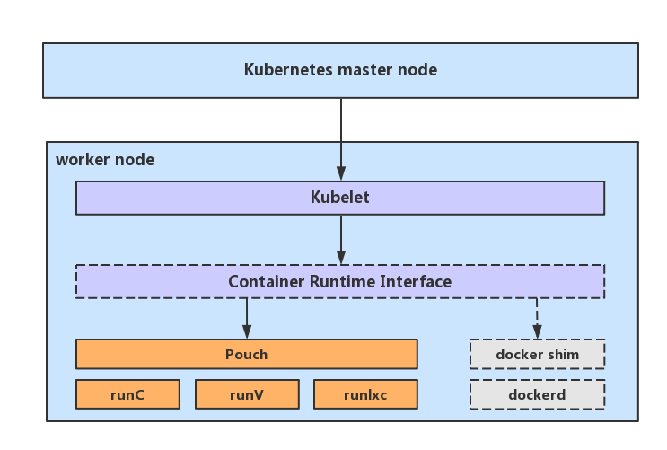

# Deploy Kubernetes With Pouch

Updated: 2018.3.30

- [Pouch deploying](#pouch-with-kubernetes-deploying)
  - [Overview](#overview)
  - [Restriction](#restriction)
  - [Install and Configure](#install-and-configure)
    - [Install Pouch](#install-pouch)
    - [Install CNI](#install-cni)
    - [Install Kubernetes Components](#install-kubernetes-components)
    - [Setting up the master node](#setting-up-the-master-node)
    - [Setting up ImageRepository](#setting-up-imagerepository)   
    - [Setting up the minion nodes](#setting-up-the-minion-nodes)
    - [Setting up CNI network routes](#setting-up-cni-network-routes)
  - [Run and Verify](#run-and-verify)
  - [Troubleshooting](#troubleshooting)

## Overview

This document shows how to easily install a Kubernetes cluster with Pouch as the container runtime in China.



## Restriction

Kubernetes: Version 1.9.X is recommanded.

NOTE: It will be failed to deploy with recent released Kubernetes 1.10.0. Because Kubernetes 1.10.0 has updated CRI from v1alpha1 to v1alpha2 which Pouch has not supported yet. We will try to full support CRI v1alpha1 first and then v1alpha2.

Pouch: Version 0.3.0 is recommanded.

### Install Pouch

You can easily setup a basic Pouch environment, see [INSTALLATION.md](../../INSTALLATION.md).

### Configure Pouch

On Ubuntu 16.04+:

```
sed -i 's/ExecStart=\/usr\/bin\/pouchd/ExecStart=\/usr\/bin\/pouchd --enable-cri=true/g' /usr/lib/systemd/system/pouch.service
systemctl daemon-reload
systemctl restart pouch
```

On CentOS 7:

```
sed -i 's/ExecStart=\/usr\/local\/bin\/pouchd/ExecStart=\/usr\/local\/bin\/pouchd --enable-cri=true/g' /lib/systemd/system/pouch.service
systemctl daemon-reload
systemctl restart pouch
```

### Install CNI

On Ubuntu 16.04+:

```
CNI_VERSION="v0.6.0"
mkdir -p /opt/cni/bin
curl -L "https://github.com/containernetworking/plugins/releases/download/${CNI_VERSION}/cni-plugins-amd64-${CNI_VERSION}.tgz" | tar -C /opt/cni/bin -xz
```

On CentOS 7:

```
cat <<EOF > /etc/yum.repos.d/kubernetes.repo 
[kubernetes] 
name=Kubernetes 
baseurl=http://mirrors.aliyun.com/kubernetes/yum/repos/kubernetes-el7-x86_64 
enabled=1 
gpgcheck=0 
repo_gpgcheck=0 
gpgkey=http://mirrors.aliyun.com/kubernetes/yum/doc/yum-key.gpg
	http://mirrors.aliyun.com/kubernetes/yum/doc/rpm-package-key.gpg 
EOF
setenforce 0
yum install -y kubernetes-cni 
```

Configure CNI networks:

- If you want to use CNI plugins like Flannel, Weave, Calico etc, please skip this section.
- Otherwise, you can use **bridge** network plugin, it's the simplest way.
  - Subnets should be different on different nodes. e.g. `10.244.1.0/24` for the master node and `10.244.2.0/24` for the first minion node.

```sh
mkdir -p /etc/cni/net.d
cat >/etc/cni/net.d/10-mynet.conf <<-EOF
{
    "cniVersion": "0.3.0",
    "name": "mynet",
    "type": "bridge",
    "bridge": "cni0",
    "isGateway": true,
    "ipMasq": true,
    "ipam": {
        "type": "host-local",
        "subnet": "10.244.1.0/24",
        "routes": [
            { "dst": "0.0.0.0/0"  }
        ]
    }
}
EOF
cat >/etc/cni/net.d/99-loopback.conf <<-EOF
{
    "cniVersion": "0.3.0",
    "type": "loopback"
}
EOF
```

### Install Kubernetes Components

On Ubuntu 16.04+:

```sh
RELEASE="v1.9.4"
mkdir -p /opt/bin
cd /opt/bin
curl -L --remote-name-all https://storage.googleapis.com/kubernetes-release/release/${RELEASE}/bin/linux/amd64/{kubeadm,kubelet,kubectl}
chmod +x {kubeadm,kubelet,kubectl}

curl -sSL "https://raw.githubusercontent.com/kubernetes/kubernetes/${RELEASE}/build/debs/kubelet.service" | sed "s:/usr/bin:/opt/bin:g" > /etc/systemd/system/kubelet.service
mkdir -p /etc/systemd/system/kubelet.service.d
curl -sSL "https://raw.githubusercontent.com/kubernetes/kubernetes/${RELEASE}/build/debs/10-kubeadm.conf" | sed "s:/usr/bin:/opt/bin:g" > /etc/systemd/system/kubelet.service.d/10-kubeadm.conf
```

On CentOS 7:

```sh
RELEASE="1.9.4-0.x86_64"
yum -y install kubelet-${RELEASE} kubeadm-${RELEASE} kubectl-${RELEASE}
```

Configure kubelet with Pouch as its runtime:

```sh
sed -i '2 i\Environment="KUBELET_EXTRA_ARGS=--container-runtime=remote --container-runtime-endpoint=unix:///var/run/pouchcri.sock --image-service-endpoint=unix:///var/run/pouchcri.sock"' /etc/systemd/system/kubelet.service.d/10-kubeadm.conf
systemctl daemon-reload
```

For more details, please check [install kubelet](https://kubernetes.io/docs/setup/independent/install-kubeadm/#installing-kubeadm-kubelet-and-kubectl).

### Setting up ImageRepository

    vim kubeadm.conf
    
    apiVersion: kubeadm.k8s.io/v1alpha1    
    kind: MasterConfiguration    
    imageRepository: registry.cn-hangzhou.aliyuncs.com/google_containers

### Setting up the master node

For more detailed Kubernetes cluster installation, please check [Using kubeadm to Create a Cluster](https://kubernetes.io/docs/setup/independent/create-cluster-kubeadm/)

```
kubeadm init --config kubeadm.conf
```

NOTE: If you want to use CNI plugin other than bridge, please check [Installing a pod network](https://kubernetes.io/docs/setup/independent/create-cluster-kubeadm/#pod-network).

Optional: enable schedule pods on the master node

```sh
export KUBECONFIG=/etc/kubernetes/admin.conf
kubectl taint nodes --all node-role.kubernetes.io/master:NoSchedule-
```

### Setting up the minion nodes

After initializing the master node, you may get the following prompt:

```
You can now join any number of machines by running the following on each node
as root:

  kubeadm join --token $token ${master_ip:port} --discovery-token-ca-cert-hash $ca-cert
```

Copy & Run it in all your minion nodes.

### Setting up CNI network routes

If your CNI plugin is bridge, you could use direct routes to connect the containers across multi-node.Suppose you have one master node and one minion node:

```
NODE   IP_ADDRESS   CONTAINER_CIDR
master 10.148.0.1  10.244.1.0/24
minion 10.148.0.2  10.244.2.0/24
```

Setting up routes:

```
# master node
ip route add 10.244.2.0/24 via 10.148.0.2

# minion node
ip route add 10.244.1.0/24 via 10.148.0.1
```

## Run and Verify

Create a deployment named `Pouch`:

```sh
# cat pouch.yaml
apiVersion: apps/v1
kind: Deployment
metadata:
  name: pouch
  labels:
    pouch: pouch
spec:
  selector:
    matchLabels:
      pouch: pouch
  template:
    metadata:
      labels:
        pouch: pouch
    spec:
      containers:
      - name: pouch
        image: docker.io/library/busybox:latest

# kubectl create -f pouch.yaml
deployment "pouch" created
```

Confirm the pod of deployment is really running:

```sh
# kubectl get pods -o wide
NAME                     READY     STATUS    RESTARTS   AGE       IP           NODE
pouch-7dcd875d69-gq5r9   1/1       Running   0          44m       10.244.1.4   master
# ping 10.244.1.4
PING 10.244.1.4 (10.244.1.4) 56(84) bytes of data.
64 bytes from 10.244.1.4: icmp_seq=1 ttl=64 time=0.065 ms
64 bytes from 10.244.1.4: icmp_seq=2 ttl=64 time=0.068 ms
64 bytes from 10.244.1.4: icmp_seq=3 ttl=64 time=0.041 ms
64 bytes from 10.244.1.4: icmp_seq=4 ttl=64 time=0.047 ms
^C
--- 10.244.1.4 ping statistics ---
4 packets transmitted, 4 received, 0% packet loss, time 3048ms
rtt min/avg/max/mdev = 0.041/0.055/0.068/0.012 ms
```

## Troubleshooting

- Because `kubeadm` still assumes docker as the only container runtime which can be used with kubernetes. When you use `kubeadm` to initialize the master node or join the minion node to the cluster, you may encounter the following error message:`[ERROR SystemVerification]: failed to get docker info: Cannot connect to the Docker daemon at unix:///var/run/docker.sock. Is the docker daemon running?`. Use the flag `--skip-preflight-checks` to skip the check, like `kubeadm init --ignore-preflight-errors=all`.

- Kubernetes 1.10.0 has been released recently and you may install it by default.However, for the NOTE metioned above, Kubernetes 1.9.X is recommanded for current Pouch.

	 In Ubuntu, we could use `apt-cache madison kubelet` to search the Kubernetes version which is available, then specify the version when install it, like `apt-get -y install
kubelet=1.9.4-00 kubeadm=1.9.4-00 kubectl=1.9.4-00`.

	In Centos, we could use `yum search --showduplicates kubelet` to search the Kubernetes version which is available, then specify the version when install it, like `yum -y install kubelet-1.9.4-0.x86_64 kubeadm-1.9.4-0.x86_64 kubectl-1.9.4-0.x86_64`

- By default Pouch will not enable the CRI. If you'd like to deploy Kubernetes with Pouch, you should start pouchd with the configuration like `pouchd --enable-cri`.

- By default Pouch will use `registry.cn-hangzhou.aliyuncs.com/google-containers/pause-amd64:3.0` as the image of infra container. If you'd like use image other than that, you could start pouchd with the configuration like `pouchd --enable-cri --sandbox-image XXX`.

- Any other troubles? Make an issue to connect with us!
